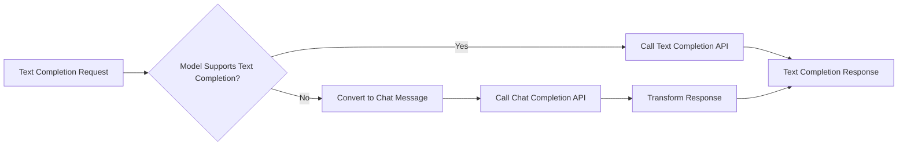
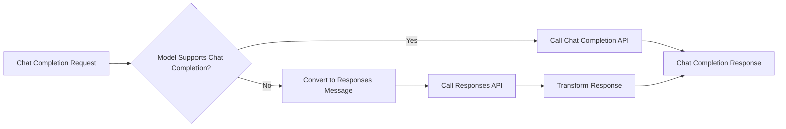

## Compatibility Transformations

The LiteLLM compatibility plugin provides two transformations:

1. **Text-to-Chat Conversion** - Automatically converts text completion requests to chat completion format for models that only support chat APIs
2. **Chat-to-Responses Conversion** - Automatically converts chat completion requests to responses format for models that only support responses APIs
3. **Drop Unsupported Params** - Automatically drops unsupported parameters if the model doesn't support them

When either transformation is applied, responses include `extra_fields.converted_request_type: <transformed_request_type>`. If request parameters are dropped, the keys are added in `extra_fields.dropped_compat_plugin_params`.

---

## 1. Text-to-Chat Conversion

Many modern AI models (like GPT-3.5-turbo, GPT-4, Claude, etc.) only support the chat completion API and don't have native text completion endpoints. LiteLLM compatibility mode automatically handles this by:

1. Checking if the model supports text completion natively (using the model catalog)
2. If not supported, converting your text prompt to chat message format
3. Calling the chat completion endpoint internally
4. Transforming the response back to text completion format
5. Returning content in `choices[0].text` instead of `choices[0].message.content`

<Note>
**Smart Conversion**: The conversion only happens when the model doesn't support text completions natively. If a model has native text completion support (like OpenAI's davinci models), Bifrost uses the text completion endpoint directly without any conversion.
</Note>

This allows you to use a unified text completion interface across all providers, even those that only support chat completions.

## How It Works

When LiteLLM compatibility is enabled and you make a text completion request, Bifrost first checks if the model supports text completion:



**Request Transformation:**
- Your text prompt becomes a user message: `{"role": "user", "content": "your prompt"}`
- Parameters like `max_tokens`, `temperature`, `top_p` are mapped to chat equivalents
- Fallbacks are preserved

**Response Transformation:**
- `choices[0].message.content` → `choices[0].text`
- `object: "chat.completion"` → `object: "text_completion"`
- Usage statistics and metadata are preserved

## 2. Chat-to-Responses Conversion

Some AI models (like OpenAI o1-pro) only support the responses API and don't support native chat completion endpoints. LiteLLM compatibility mode automatically handles this by:

1. Checking if the model supports chat completion natively (using the model catalog)
2. If not supported, converting your chat message to responses API format
3. Calling the responses endpoint internally
4. Transforming the response back to chat completion format

<Note>
**Smart Conversion**: The conversion only happens when the model doesn't support chat completions natively. If a model has native chat completion support (like OpenAI's gpt-4 models), Bifrost uses the chat completion endpoint directly without any conversion.
</Note>

This allows you to use a unified chat completion interface across all providers, even those that only support responses API.

## How It Works

When LiteLLM compatibility is enabled and you make a chat completion request, Bifrost first checks if the model supports chat completion:



## Enabling LiteLLM Compatibility

<Tabs group="litellm-compat">

<Tab title="Gateway UI">

1. Open the Bifrost dashboard
2. Navigate to **Settings** → **Client Configuration**
3. Expand **LiteLLM Compat** and enable the features you need:
   - **Convert Text to Chat** — converts text completion requests to chat for models that only support chat
   - **Convert Chat to Responses** — converts chat completion requests to responses for models that only support responses
   - **Drop Unsupported Params** — drops unsupported parameters based on model catalog allowlist
4. Save your configuration

</Tab>

<Tab title="Configuration File">

```json
{
  "client_config": {
    "compat": {
      "convert_text_to_chat": true,
      "convert_chat_to_responses": true,
      "should_drop_params": true
    }
  }
}
```

</Tab>

</Tabs>

## Supported Providers

Text completion to chat completion conversion works with any provider that supports chat completions but lacks native text completion support:

| Provider | Native Text Completion | With Fallback |
|----------|----------------------|------------------|
| OpenAI (GPT-4, GPT-3.5-turbo) | No | Yes |
| Anthropic (Claude) | No | Yes |
| Groq | No | Yes |
| Gemini | No | Yes |
| Mistral | No | Yes |
| Bedrock | Varies by model | Yes |

Chat completion to responses conversion works with any provider that supports responses but lacks native chat completion support:

| Provider | Native Chat Completion | With Fallback |
|----------|----------------------|------------------|
| OpenAI (o1-pro) | No | Yes |

## Behavior Details

**Model Capability Detection:**
- Bifrost uses the model catalog to check if a model supports text completion
- If the model has a "completion" mode in its pricing data, it supports text completion
- Conversion only happens when the model lacks native text completion support

## Transformations Reference

### Transformation 1: Text-to-Chat Conversion

**Applies to:** Text completion requests on chat-only models

| Phase | Original | Transformed |
|-------|----------|-------------|
| Request | Text prompt (string) | Chat message with `role: "user"` |
| Request | Array prompts | Concatenated into text content blocks |
| Request | `text_completion` request type | `chat_completion` request type |
| Request | `max_tokens`, `temperature`, `top_p` | Mapped to chat equivalents |
| Response | `choices[0].message.content` | `choices[0].text` |
| Response | `object: "chat.completion"` | `object: "text_completion"` |

### Transformation 2: Chat-to-Responses Conversion

**Applies to:** Chat completion requests on responses-only models

| Phase | Original | Transformed |
|-------|----------|-------------|
| Request | Chat message with `role: "user"` | Responses input with `role: "user"` |
| Request | `chat_completion` request type | `responses` request type |

### Metadata Set on Transformed Responses

When either transformation is applied:

- `extra_fields.request_type`: Reflects the original request type
- `extra_fields.original_model_requested`: The originally requested model
- `extra_fields.resolved_model_used`: The actual provider API identifier used (equals original_model_requested when no alias mapping exists)

### Error Handling

When errors occur on transformed requests:
- Original request type and model are preserved in error metadata
- `extra_fields.converted_request_type`: Set to type of request that was converted to (i.e., `chat_completion` or `responses`)
- `extra_fields.provider`: The provider that handled the request
- `extra_fields.original_model_requested`: The originally requested model
- `extra_fields.dropped_compat_plugin_params`: If any unsupported parameters were dropped, the keys are added here

## What's Preserved

- Model selection and fallback chain
- Temperature, top_p, max_tokens, and other generation parameters
- Stop sequences and frequency/presence penalties
- Usage statistics and token counts

## When to Use This

**Good Use Cases:**
- Migrating from LiteLLM to Bifrost without code changes
- Maintaining backward compatibility with text completion interfaces or chat completion interfaces
- Using a unified API across providers with different capabilities

**Consider Alternatives When:**
- You need chat-specific features (system messages, conversation history)
- You want explicit control over message formatting
- Performance is critical (direct chat requests avoid conversion overhead)

## Related Features

- [Fallbacks](/features/fallbacks) - Automatic provider failover
- [Drop-in Replacement](/features/drop-in-replacement) - Use existing SDKs with Bifrost
- [LiteLLM Integration](/integrations/litellm-sdk) - Using LiteLLM SDK with Bifrost