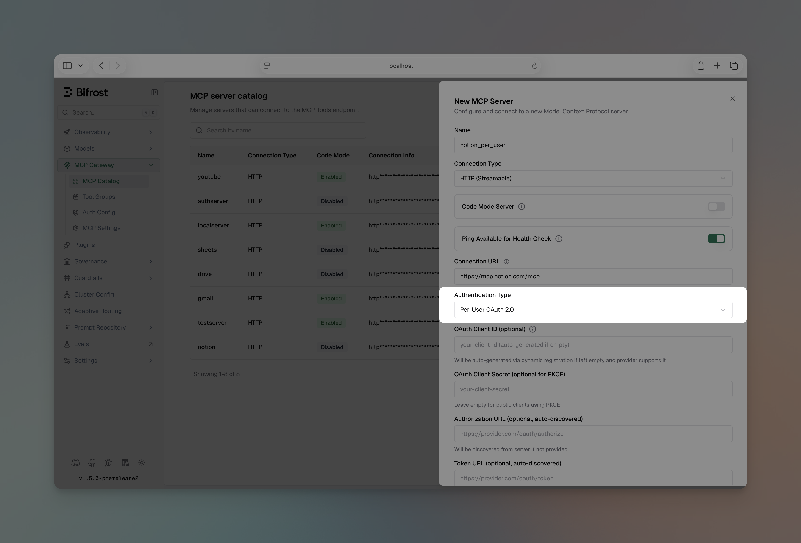
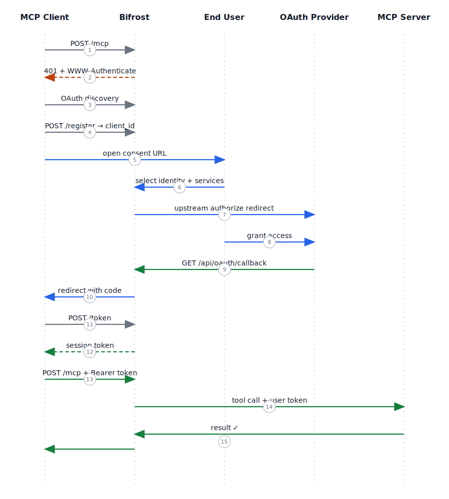
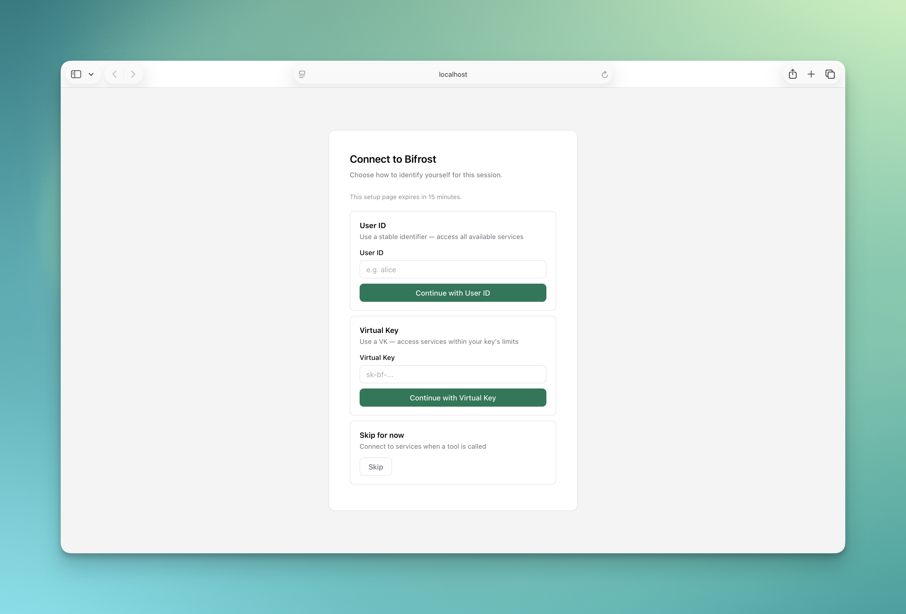
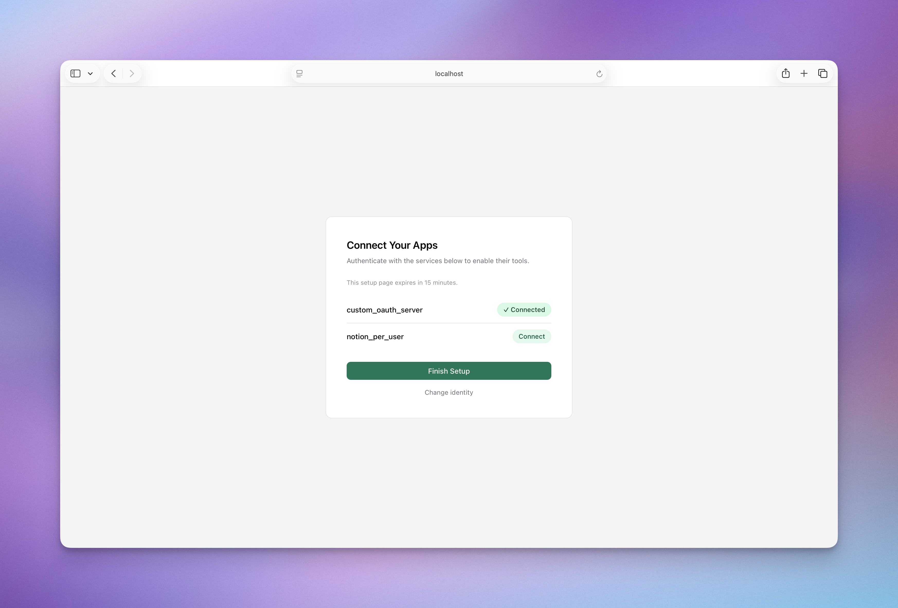
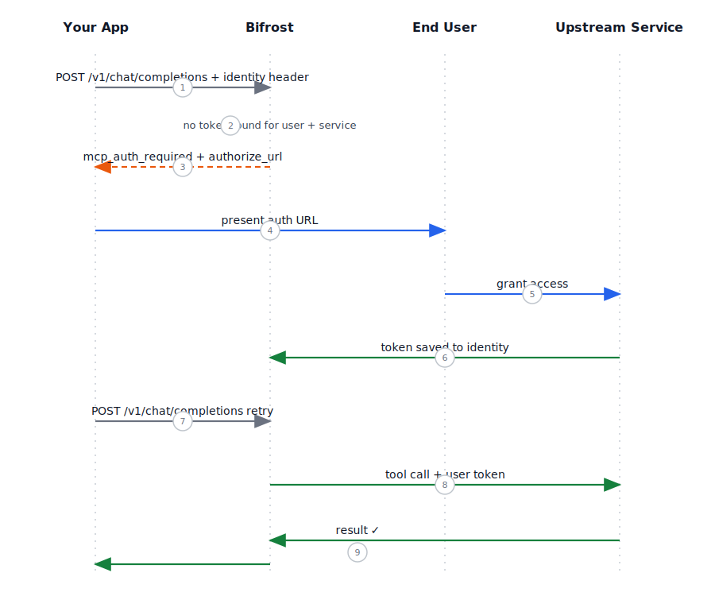

## Overview

<Info>Per-user OAuth is available in **Bifrost v1.5.0-prerelease2 and above**.</Info>

**Per-user OAuth** lets each end-user connect to upstream MCP services (Notion, GitHub, etc.) using their own credentials. Instead of a single shared admin token, every user gets their own access — scoped to their account, their data.

This is different from [server-level OAuth](./oauth), where an admin authenticates once and every request uses the same shared token:

| | Server-level OAuth | Per-user OAuth |
|---|---|---|
| Who authenticates | Admin, once | Each end-user individually |
| Token scope | Shared across all requests | Per-user, per-service |
| Identity required | No | Yes (VK, User ID, or session) |
| Persists across sessions | Yes (background refresh) | Yes, when tied to VK or User ID |
| Works with MCP Gateway | Yes | Yes |
| Works with LLM Gateway | Yes | Yes |

---

## Setup

Per-user OAuth is configured through the Web UI only. During setup, Bifrost runs a test OAuth flow and pre-fetches the available tools from the upstream service — this is why file-based config is not supported for this auth type.

<Tabs>
<Tab title="Web UI">

1. Navigate to **MCP Gateway** and click **New MCP Server**
2. Select **HTTP** or **SSE** as the connection type and enter the server URL
3. Set **Auth Type** to **Per-User OAuth**
4. Fill in the OAuth application credentials:
   - **Client ID** — your upstream OAuth app's client ID
   - **Client Secret** — optional for PKCE flows
   - **Authorize URL** — upstream authorization endpoint (or leave blank for auto-discovery)
   - **Token URL** — upstream token endpoint (or leave blank for auto-discovery)
   - **Scopes** — comma-separated list of requested scopes
5. Click **Create** — Bifrost runs a test OAuth flow to validate the config and pre-fetches the tool list
6. Complete the authorization in your browser
7. Save the MCP client



</Tab>
</Tabs>

<Info>
If your upstream server supports OAuth Discovery (RFC 8414), you can leave the authorize and token URLs blank and provide only the **Server URL**. Bifrost will discover the endpoints automatically.
</Info>

---

## How it works: MCP Gateway

When you expose Bifrost as an MCP server (via the `/mcp` endpoint) and at least one MCP client is configured with `per_user_oauth`, Bifrost becomes an **OAuth 2.1 Authorization Server**. OAuth-capable MCP clients like Claude Code and Cursor detect this automatically — no manual configuration required on the client side.

The full flow involves three distinct phases: **discovery** (the client finds Bifrost's OAuth endpoints), **consent** (the user attaches an identity and connects upstream services), and **authenticated use** (all subsequent tool calls carry the user's tokens transparently). The diagram below shows all three phases end to end.



### First connection: the consent flow

The first time a client connects, Bifrost walks the user through a two-step consent screen:

**Step 1 — Identity selection**

The user chooses how to identify themselves for this session:

- **Virtual Key** — ties upstream tokens to the VK permanently; tokens survive session restarts and work across the LLM Gateway too
- **User ID** — a self-declared identifier with the same persistence guarantees as a VK
- **Skip** — no identity attached; tokens are scoped to this session only and won't carry over to other sessions or the LLM Gateway



**Step 2 — Connect upstream services**

The user sees all per-user OAuth MCP servers available on their Virtual Key. They can connect all of them at once or just the ones they want right now.



For each selected service, the user is redirected to the upstream OAuth provider (Notion, GitHub, etc.) to authorize access. After authorizing, they return to Bifrost and can connect additional services or finish.

**Step 3 — Done**

Bifrost issues a 24-hour session token. The MCP client receives this token and proceeds normally. All subsequent tool calls use the user's upstream tokens transparently.

### Lazy auth for skipped services

If the user skips a service during consent — or a new per-user MCP server is added later — Bifrost handles it lazily. When a tool call hits a service the user hasn't authenticated with yet, Bifrost returns an auth URL in the tool result instead of executing the tool:

```
Authentication required for Notion. Open this URL to connect:
https://your-bifrost-domain.com/api/oauth/per-user/upstream/authorize?...
```


The user opens the URL, completes the upstream OAuth flow, and Bifrost saves the token against their session identity. The next tool call proceeds without any re-auth. This lazy pattern is the same one used by the LLM Gateway — the only difference is the auth URL surfaces as a tool result message rather than an API response field.

---

## How it works: LLM Gateway

When using per-user OAuth through the LLM Gateway (`/v1/chat/completions`), there is no upfront consent screen. Auth is **entirely lazy** — Bifrost waits until a tool actually needs a token before asking for one. This is also the same pattern used when a service is skipped during MCP Gateway consent.

The pattern is simple: every request carries an identity header, and any tool call to an unauthenticated service returns an auth URL instead of a result. The user completes auth once at that URL; all subsequent calls to that service execute normally. The diagram below shows the full cycle.



1. The user makes a request with an identity header attached (required — see below)
2. The LLM suggests a tool call to a per-user OAuth service
3. If no token exists for that user + service, Bifrost returns an `mcp_auth_required` response with an `authorize_url` **instead of executing the tool** — the rest of the LLM response still comes through normally


4. The user opens the URL and completes the upstream OAuth flow
5. Bifrost saves the token against their identity — no action needed on your side
6. On the next request, the tool call executes normally — no re-auth, no special handling required

### Identity is required

The LLM Gateway has no session management, so an identity must be declared on every request. Without one, Bifrost has no stable key to look up or store tokens against.

Pass one of:

```bash
# Virtual Key (recommended — also works with MCP Gateway)
-H "x-bf-virtual-key: vk_your_key"

# Self-declared User ID
-H "X-Bf-User-Id: user_123"
```

<Note>
**Enterprise**: When enterprise user identity is configured, the user's identity is automatically attached as the User ID — no manual header required.
</Note>

---

## Cross-gateway token sharing

Tokens are stored against an **identity** (Virtual Key or User ID), not against a gateway. This means:

- Authenticate via the **LLM Gateway** with a VK → that token is immediately usable on the **MCP Gateway** with the same VK
- Authenticate via the **MCP Gateway** consent flow with a VK → that VK works on the **LLM Gateway** with no re-auth needed

The only exception is **Skip** (session-only) auth: those tokens are not associated with any persistent identity and cannot be used from the LLM Gateway.

| Identity mode | Set via | Cross-gateway portable | Persists across sessions |
|---|---|---|---|
| Virtual Key | Consent screen or `x-bf-virtual-key` header | Yes | Yes |
| User ID | Consent screen or `X-Bf-User-Id` header | Yes | Yes |
| Skip (MCP Gateway only) | Consent screen | No | No |

---

## Config reference

Per-user OAuth is configured on the MCP client via `auth_type`. When `auth_type` is `per_user_oauth`, an `oauth_config_id` linking to the OAuth credentials is required (set automatically during UI setup):

```json
{
  "mcp": {
    "mcp_clients": [
      {
        "name": "notion",
        "connection_type": "http",
        "connection_string": "https://mcp.notion.so/sse",
        "auth_type": "per_user_oauth",
        "oauth_config_id": "oauth_cfg_abc123",
        "tools_to_execute": ["*"]
      }
    ]
  }
}
```

| Field | Type | Description |
|---|---|---|
| `auth_type` | string | Set to `"per_user_oauth"` |
| `oauth_config_id` | string | ID of the OAuth config created during UI setup |

---

## Next Steps

- [Server-level OAuth →](./oauth) — admin authenticates once, shared token for all requests
- [MCP Gateway URL →](./gateway-url) — expose Bifrost as an MCP server for Claude Code and Cursor
- [Tool Filtering →](./filtering) — control which per-user tools are available per Virtual Key
