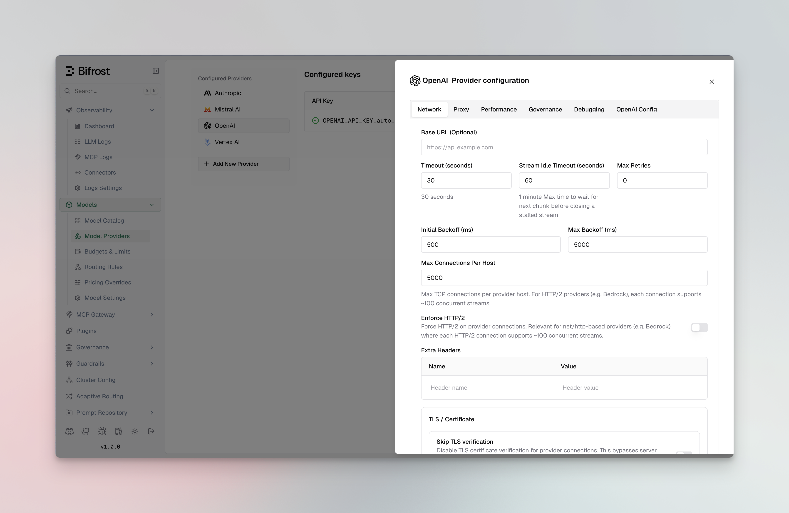
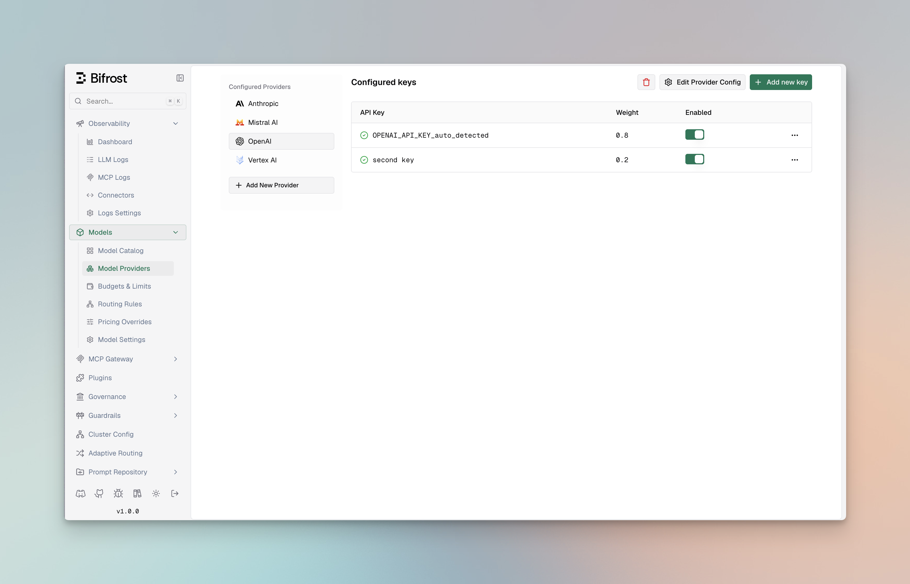

## Multi-Provider Setup

Configure multiple providers to seamlessly switch between them. This example shows how to configure OpenAI, Anthropic, and Mistral providers.

<Tabs group="provider-config">

<Tab title="Using Web UI">



1. Go to **http://localhost:8080**
2. Navigate to **"Model Providers"** in the sidebar
3. Select provider and configure keys

</Tab>

<Tab title="Using API">

```bash
# Add OpenAI provider
curl --location 'http://localhost:8080/api/providers' \
--header 'Content-Type: application/json' \
--data '{
    "provider": "openai",
    "keys": [
        {
            "name": "openai-key-1",
            "value": "env.OPENAI_API_KEY",
            "models": ["*"],
            "weight": 1.0
        }
    ]
}'

# Add Anthropic provider
curl --location 'http://localhost:8080/api/providers' \
--header 'Content-Type: application/json' \
--data '{
    "provider": "anthropic",
    "keys": [
        {
            "name": "anthropic-key-1",
            "value": "env.ANTHROPIC_API_KEY",
            "models": ["*"],
            "weight": 1.0
        }
    ]
}'

# Add vLLM (self-hosted OpenAI-compatible server)
curl --location 'http://localhost:8080/api/providers' \
--header 'Content-Type: application/json' \
--data '{
    "provider": "vllm-local",
    "keys": [
        {
            "name": "vllm-key-1",
            "value": "dummy",
            "models": ["*"],
            "weight": 1.0
        }
    ],
    "network_config": {
        "base_url": "http://vllm-endpoint:8000",
        "default_request_timeout_in_seconds": 60
    },
    "custom_provider_config": {
        "base_provider_type": "openai",
        "allowed_requests": {
            "chat_completion": true,
            "chat_completion_stream": true
        }
    }
}'
```

</Tab>

<Tab title="Using config.json">

<Note>
Each key in a provider needs to have a unique name.
</Note>


```json
{
    "providers": {
        "openai": {
            "keys": [
                {
                    "name": "openai-key",
                    "value": "env.OPENAI_API_KEY",
                    "models": ["*"],
                    "weight": 1.0
                }
            ]
        },
        "anthropic": {
            "keys": [
                {
                    "name": "anthropic-key",
                    "value": "env.ANTHROPIC_API_KEY",
                    "models": ["*"],
                    "weight": 1.0
                }
            ]
        },
        "vllm-local": {
            "keys": [
                {
                    "name": "vllm-key",
                    "value": "dummy",
                    "models": ["*"],
                    "weight": 1.0
                }
            ],
            "network_config": {
                "base_url": "http://vllm-endpoint:8000",
                "default_request_timeout_in_seconds": 60
            },
            "custom_provider_config": {
                "base_provider_type": "openai",
                "allowed_requests": {
                    "chat_completion": true,
                    "chat_completion_stream": true
                }
            }
        }
    }
}
```


</Tab>

</Tabs>

<Tip>
**Kubernetes DNS (only for custom endpoint):** When running in Kubernetes, use fully qualified domain names (FQDN) like `http://<service>.<namespace>.svc.cluster.local:8000` for cross-namespace custom endpoints. Short names like `http://<service>:8000` only work within the same namespace.
</Tip>

<Tip>
**Air-gapped or self-signed certificates:** If your custom provider uses HTTPS with a self-signed or internal CA certificate, add `"insecure_skip_verify": true` or `"ca_cert_pem": "-----BEGIN CERTIFICATE-----\n...\n-----END CERTIFICATE-----"` to `network_config`. See [Custom Providers - TLS](../../providers/custom-providers#tls-for-self-signed-or-internal-certificates) for details.
</Tip>

## Making Requests

Once providers are configured, you can make requests to any specific provider. This example shows how to send a request directly to OpenAI's GPT-4o Mini model. Bifrost handles the provider-specific API formatting automatically.

```bash
curl --location 'http://localhost:8080/v1/chat/completions' \
--header 'Content-Type: application/json' \
--data '{
    "model": "openai/gpt-4o-mini",
    "messages": [
        {"role": "user", "content": "Hello!"}
    ]
}'
```

## Environment Variables

Set up your API keys for the providers you want to use. Bifrost supports both direct key values and environment variable references with the `env.` prefix:

```bash
export OPENAI_API_KEY="your-openai-api-key"
export ANTHROPIC_API_KEY="your-anthropic-api-key"
export MISTRAL_API_KEY="your-mistral-api-key"
export CEREBRAS_API_KEY="your-cerebras-api-key"
export GROQ_API_KEY="your-groq-api-key"
export COHERE_API_KEY="your-cohere-api-key"
```

**Environment Variable Handling:**
- Use `"value": "env.VARIABLE_NAME"` to reference environment variables
- Use `"value": "sk-proj-xxxxxxxxx"` to pass keys directly
- All sensitive data is automatically redacted in GET requests and UI responses for security

## Advanced Configuration

### Weighted Load Balancing

Distribute requests across multiple API keys or providers based on custom weights. This example shows how to split traffic 70/30 between two OpenAI keys, useful for managing rate limits or costs across different accounts.

<Tabs group="load-balancing">

<Tab title="Using Web UI">



1. Navigate to **"Model Providers"** → **"Configurations"** → **"OpenAI"**
2. Click **"Add Key"** to add multiple keys
3. Set weight values (0.7 and 0.3)
4. Save configuration

</Tab>

<Tab title="Using API">

```bash
curl --location 'http://localhost:8080/api/providers' \
--header 'Content-Type: application/json' \
--data '{
    "provider": "openai",
    "keys": [
        {
            "name": "openai-key-1",
            "value": "env.OPENAI_API_KEY_1",
            "models": ["*"],
            "weight": 0.7
        },
        {
            "name": "openai-key-2",
            "value": "env.OPENAI_API_KEY_2", 
            "models": ["*"],
            "weight": 0.3
        }
    ]
}'
```

</Tab>

<Tab title="Using config.json">

```json
{
    "providers": {
        "openai": {
            "keys": [
                {
                    "name": "openai-key-1",
                    "value": "env.OPENAI_API_KEY_1",
                    "models": ["*"],
                    "weight": 0.7
                },
                {
                    "name": "openai-key-2",
                    "value": "env.OPENAI_API_KEY_2",
                    "models": ["*"],
                    "weight": 0.3
                }
            ]
        }
    }
}
```

</Tab>

</Tabs>

### Model-Specific Keys

Use different API keys for specific models, allowing you to manage access controls and billing separately. This example uses a premium key for advanced reasoning models (o1-preview, o1-mini) and a standard key for regular GPT models.

<Tabs group="model-keys">

<Tab title="Using Web UI">


1. Navigate to **"Model Providers"** → **"Configurations"** → **"OpenAI"**
2. Add first key with models: `["gpt-4o", "gpt-4o-mini"]`
3. Add premium key with models: `["o1-preview", "o1-mini"]`
4. Save configuration

</Tab>

<Tab title="Using API">

```bash
curl --location 'http://localhost:8080/api/providers' \
--header 'Content-Type: application/json' \
--data '{
    "provider": "openai",
    "keys": [
        {
            "name": "openai-key-1",
            "value": "env.OPENAI_API_KEY",
            "models": ["gpt-4o", "gpt-4o-mini"],
            "weight": 1.0
        },
        {
            "name": "openai-key-2",
            "value": "env.OPENAI_API_KEY_PREMIUM",
            "models": ["o1-preview", "o1-mini"],
            "weight": 1.0
        }
    ]
}'
```

</Tab>

<Tab title="Using config.json">

```json
{
    "providers": {
        "openai": {
            "keys": [
                {
                    "name": "openai-key-1",
                    "value": "env.OPENAI_API_KEY",
                    "models": ["gpt-4o", "gpt-4o-mini"],
                    "weight": 1.0
                },
                {
                    "name": "openai-key-2",
                    "value": "env.OPENAI_API_KEY_PREMIUM",
                    "models": ["o1-preview", "o1-mini"],
                    "weight": 1.0
                }
            ]
        }
    }
}
```

</Tab>

</Tabs>

### Custom Base URL

Override the default API endpoint for a provider. This is useful for connecting to self-hosted models, local development servers, or OpenAI-compatible APIs like vLLM, Ollama, or LiteLLM.

<Tabs group="base-url-config">

<Tab title="Using Web UI">


<Frame>
  <video autoPlay playsInline muted>
    <source src="/media/custom-base-url.mp4" type="video/mp4" />
  </video>
</Frame>

1. Navigate to **"Model Providers"** → **"Configurations"** → **"OpenAI"** → **"Provider level configuration"** → **"Network config"**
2. Set **Base URL**: `http://localhost:8000/v1`
3. Save configuration

</Tab>

<Tab title="Using API">

```bash
curl --location 'http://localhost:8080/api/providers' \
--header 'Content-Type: application/json' \
--data '{
    "provider": "openai",
    "keys": [
        {
            "name": "openai-key-1",
            "value": "env.OPENAI_API_KEY",
            "models": ["*"],
            "weight": 1.0
        }
    ],
    "network_config": {
        "base_url": "http://localhost:8000/v1"
    }
}'
```

</Tab>

<Tab title="Using config.json">

```json
{
    "providers": {
        "openai": {
            "keys": [
                {
                    "name": "openai-key-1",
                    "value": "env.OPENAI_API_KEY",
                    "models": ["*"],
                    "weight": 1.0
                }
            ],
            "network_config": {
                "base_url": "http://localhost:8000/v1"
            }
        }
    }
}
```

</Tab>

</Tabs>

<Note>
For self-hosted providers like Ollama and SGL, `base_url` is required. For standard providers, it's optional and overrides the default endpoint.
</Note>

### Managing Retries

Configure retry behavior for handling temporary failures and rate limits. This example sets up exponential backoff with up to 5 retries, starting with 1ms delay and capping at 10 seconds - ideal for handling transient network issues.

<Tabs group="retry-config">

<Tab title="Using Web UI">


1. Navigate to **"Model Providers"** → **"Configurations"** → **"OpenAI"** → **"Provider level configuration"** → **"Network config"**
2. Set **Max Retries**: `5`
3. Set **Initial Backoff**: `1` ms
4. Set **Max Backoff**: `10000` ms
5. Save configuration

</Tab>

<Tab title="Using API">

```bash
curl --location 'http://localhost:8080/api/providers' \
--header 'Content-Type: application/json' \
--data '{
    "provider": "openai",
    "keys": [
        {
            "name": "openai-key-1",
            "value": "env.OPENAI_API_KEY",
            "models": ["*"],
            "weight": 1.0
        }
    ],
    "network_config": {
        "max_retries": 5,
        "retry_backoff_initial_ms": 1,
        "retry_backoff_max_ms": 10000
    }
}'
```

</Tab>

<Tab title="Using config.json">

```json
{
    "providers": {
        "openai": {
            "keys": [
                {
                    "name": "openai-key-1",
                    "value": "env.OPENAI_API_KEY",
                    "models": ["*"],
                    "weight": 1.0
                }
            ],
            "network_config": {
                "max_retries": 5,
                "retry_backoff_initial_ms": 1,
                "retry_backoff_max_ms": 10000
            }
        }
    }
}
```

</Tab>

</Tabs>

### Custom Concurrency and Buffer Size

Fine-tune performance by adjusting worker concurrency and queue sizes per provider (defaults are 1000 workers and 5000 queue size). This example gives OpenAI higher limits (100 workers, 500 queue) for high throughput, while Anthropic gets conservative limits to respect their rate limits.

<Tabs group="concurrency-config">

<Tab title="Using Web UI">


1. Navigate to **"Model Providers"** → **"Configurations"** → **{Provider}** → **"Provider level configuration"** → **"Performance tuning"**
2. Set **Concurrency**: Worker count (100 for OpenAI, 25 for Anthropic)
3. Set **Buffer Size**: Queue size (500 for OpenAI, 100 for Anthropic)
4. Save configuration

</Tab>

<Tab title="Using API">

```bash
# OpenAI with high throughput settings
curl --location 'http://localhost:8080/api/providers' \
--header 'Content-Type: application/json' \
--data '{
    "provider": "openai",
    "keys": [
        {
            "name": "openai-key-1",
            "value": "env.OPENAI_API_KEY",
            "models": ["*"],
            "weight": 1.0
        }
    ],
    "concurrency_and_buffer_size": {
        "concurrency": 100,
        "buffer_size": 500
    }
}'

# Anthropic with conservative settings
curl --location 'http://localhost:8080/api/providers' \
--header 'Content-Type: application/json' \
--data '{
    "provider": "anthropic", 
    "keys": [
        {
            "name": "openai-key-1",
            "value": "env.ANTHROPIC_API_KEY",
            "models": ["*"],
            "weight": 1.0
        }
    ],
    "concurrency_and_buffer_size": {
        "concurrency": 25,
        "buffer_size": 100
    }
}'
```

</Tab>

<Tab title="Using config.json">

```json
{
    "providers": {
        "openai": {
            "keys": [
                {
                    "name": "openai-key-1",
                    "value": "env.OPENAI_API_KEY",
                    "models": ["*"],
                    "weight": 1.0
                }
            ],
            "concurrency_and_buffer_size": {
                "concurrency": 100,
                "buffer_size": 500
            }
        },
        "anthropic": {
            "keys": [
                {
                    "name": "anthropic-key-1",
                    "value": "env.ANTHROPIC_API_KEY",
                    "models": ["*"],
                    "weight": 1.0
                }
            ],
            "concurrency_and_buffer_size": {
                "concurrency": 25,
                "buffer_size": 100
            }
        }
    }
}
```

</Tab>

</Tabs>

### Custom Headers

Bifrost supports two ways to add custom headers to provider requests: **static headers** configured at the provider level, and **dynamic headers** passed per-request.

#### Static Headers (Provider Level)

Configure headers that are automatically included in every request to a specific provider. This is useful for provider-specific requirements, API versioning, or organizational metadata.

<Tabs group="static-headers">

<Tab title="Using Web UI">


1. Navigate to **"Model Providers"** → **"Configurations"** → **"OpenAI"** → **"Provider level configuration"** → **"Network config"**
2. Add headers in the **"Extra Headers"** section
3. Save configuration

</Tab>

<Tab title="Using API">

```bash
curl --location 'http://localhost:8080/api/providers' \
--header 'Content-Type: application/json' \
--data '{
    "provider": "openai",
    "keys": [
        {
            "name": "openai-key-1",
            "value": "env.OPENAI_API_KEY",
            "models": ["*"],
            "weight": 1.0
        }
    ],
    "network_config": {
        "extra_headers": {
            "x-custom-org": "my-organization",
            "x-environment": "production"
        }
    }
}'
```

</Tab>

<Tab title="Using config.json">

```json
{
    "providers": {
        "openai": {
            "keys": [
                {
                    "name": "openai-key-1",
                    "value": "env.OPENAI_API_KEY",
                    "models": ["*"],
                    "weight": 1.0
                }
            ],
            "network_config": {
                "extra_headers": {
                    "x-custom-org": "my-organization",
                    "x-environment": "production"
                }
            }
        }
    }
}
```

</Tab>

</Tabs>

#### Dynamic Headers (Per Request)

Send custom headers with individual requests using the `x-bf-eh-*` prefix. Headers are automatically propagated to the provider after stripping the prefix. This is useful for request-specific metadata, user identification, or custom tracking information.

```bash
curl --location 'http://localhost:8080/v1/chat/completions' \
--header 'Content-Type: application/json' \
--header 'x-bf-eh-user-id: user-123' \
--header 'x-bf-eh-tracking-id: trace-456' \
--data '{
    "model": "openai/gpt-4o-mini",
    "messages": [
        {"role": "user", "content": "Hello!"}
    ]
}'
```

The `x-bf-eh-` prefix is stripped before forwarding, so `x-bf-eh-user-id` becomes `user-id` in the request to the provider.

**Example use cases:**
- User identification: `x-bf-eh-user-id`, `x-bf-eh-tenant-id`
- Request tracking: `x-bf-eh-correlation-id`, `x-bf-eh-trace-id`
- Custom metadata: `x-bf-eh-department`, `x-bf-eh-cost-center`
- A/B testing: `x-bf-eh-experiment-id`, `x-bf-eh-variant`

#### Security Denylist

Bifrost maintains a security denylist of headers that are never forwarded to providers, regardless of configuration:

```go
denylist := map[string]bool{
    "proxy-authorization": true,
    "cookie":              true,
    "host":                true,
    "content-length":      true,
    "connection":          true,
    "transfer-encoding":   true,

    // prevent auth/key overrides via x-bf-eh-*
    "x-api-key":      true,
    "x-goog-api-key": true,
    "x-bf-api-key":   true,
    "x-bf-vk":        true,
}
```

This denylist is applied to both static and dynamic headers to prevent security vulnerabilities.

#### Beta Header Overrides

For Anthropic-family providers (Anthropic, Vertex, Bedrock, Azure), Bifrost maintains a default support matrix for `anthropic-beta` headers. You can override these defaults per provider when upstream support changes before Bifrost updates its defaults.

<Tabs group="beta-header-overrides">

<Tab title="Using Web UI">

1. Navigate to **"Model Providers"** → **"Configurations"** → select your provider → **"Beta Headers"** tab
2. Each known beta header shows its default support status
3. Use the override dropdown to set **Enabled**, **Disabled**, or **Default** (use built-in defaults)
4. Save configuration

</Tab>

<Tab title="Using API">

```bash
curl --location --request PUT 'http://localhost:8080/api/providers/vertex' \
--header 'Content-Type: application/json' \
--data '{
    "network_config": {
        "beta_header_overrides": {
            "redact-thinking-": true,
            "fast-mode-": false
        }
    }
}'
```

</Tab>

<Tab title="Using config.json">

```json
{
    "providers": {
        "vertex": {
            "network_config": {
                "beta_header_overrides": {
                    "redact-thinking-": true,
                    "fast-mode-": false
                }
            }
        }
    }
}
```

</Tab>

</Tabs>

Override keys are beta header **prefixes** (e.g. `"redact-thinking-"`), not full header values. This ensures overrides apply regardless of date-versioned header bumps. See the full support matrix in the [Anthropic provider docs](/providers/supported-providers/anthropic#beta-headers).

### Setting Up a Proxy

Route requests through proxies for compliance, security, or geographic requirements. This example shows both HTTP proxy for OpenAI and authenticated SOCKS5 proxy for Anthropic, useful for corporate environments or regional access.

<Tabs group="proxy-config">

<Tab title="Using Web UI">


1. Navigate to **"Model Providers"** → **"Configurations"** → **{Provider}** → **"Provider level configuration"** → **"Proxy config"**
2. Select **Proxy Type**: HTTP or SOCKS5
3. Set **Proxy URL**: `http://localhost:8000`
4. Add credentials if needed (username/password)
5. Save configuration

</Tab>

<Tab title="Using API">

```bash
# HTTP proxy for OpenAI
curl --location 'http://localhost:8080/api/providers' \
--header 'Content-Type: application/json' \
--data '{
    "provider": "openai",
    "keys": [
        {
            "name": "openai-key-1",
            "value": "env.OPENAI_API_KEY",
            "models": ["*"],
            "weight": 1.0
        }
    ],
    "proxy_config": {
        "type": "http",
        "url": "http://localhost:8000"
    }
}'

# SOCKS5 proxy with authentication for Anthropic
curl --location 'http://localhost:8080/api/providers' \
--header 'Content-Type: application/json' \
--data '{
    "provider": "anthropic",
    "keys": [
        {
            "name": "anthropic-key-1",
            "value": "env.ANTHROPIC_API_KEY",
            "models": ["*"],
            "weight": 1.0
        }
    ],
    "proxy_config": {
        "type": "socks5",
        "url": "http://localhost:8000",
        "username": "user",
        "password": "password"
    }
}'
```

</Tab>

<Tab title="Using config.json">

```json
{
    "providers": {
        "openai": {
            "keys": [
                {
                    "name": "openai-key-1",
                    "value": "env.OPENAI_API_KEY",
                    "models": ["*"],
                    "weight": 1.0
                }
            ],
            "proxy_config": {
                "type": "http",
                "url": "http://localhost:8000"
            }
        },
        "anthropic": {
            "keys": [
                {
                    "name": "anthropic-key-1",
                    "value": "env.ANTHROPIC_API_KEY",
                    "models": ["*"],
                    "weight": 1.0
                }
            ],
            "proxy_config": {
                "type": "socks5",
                "url": "http://localhost:8000",
                "username": "user",
                "password": "password"
            }
        }
    }
}
```

</Tab>

</Tabs>

### Send Back Raw Response

Include the original provider response alongside Bifrost's standardized response format. Useful for debugging and accessing provider-specific metadata.

<Note>
You can override this per request using the `x-bf-send-back-raw-response` header (`"true"` or `"false"`), regardless of the provider-level config. See [Request Options](../../providers/request-options#send-back-raw-response) for details.
</Note>

<Tabs group="raw-response">

<Tab title="Using Web UI">


1. Navigate to **"Model Providers"** → **"Configurations"** → **{Provider}** → **"Provider level configuration"** → **"Performance tuning"**
2. Toggle **"Include Raw Response"** to enabled
3. Save configuration

</Tab>

<Tab title="Using API">

```bash
curl --location 'http://localhost:8080/api/providers' \
--header 'Content-Type: application/json' \
--data '{
    "provider": "openai",
    "keys": [
        {
            "name": "openai-key-1",
            "value": "env.OPENAI_API_KEY",
            "models": ["*"],
            "weight": 1.0
        }
    ],
    "send_back_raw_response": true
}'
```

</Tab>

<Tab title="Using config.json">

```json
{
    "providers": {
        "openai": {
            "keys": [
                {
                    "name": "openai-key-1",
                    "value": "env.OPENAI_API_KEY",
                    "models": ["*"],
                    "weight": 1.0
                }
            ],
            "send_back_raw_response": true
        }
    }
}
```

</Tab>

</Tabs>

When enabled, the raw provider response appears in `extra_fields.raw_response`:

```json
{
    "choices": [...],
    "usage": {...},
    "extra_fields": {
        "provider": "openai",
        "raw_response": {
            // Original OpenAI response here
        }
    }
}
```

### Send Back Raw Request

Include the original request sent to the provider alongside Bifrost's response. Useful for debugging request transformations and verifying what was actually sent to the provider.

<Note>
You can override this per request using the `x-bf-send-back-raw-request` header (`"true"` or `"false"`), regardless of the provider-level config. See [Request Options](../../providers/request-options#send-back-raw-request) for details.
</Note>

<Tabs group="raw-request">

<Tab title="Using Web UI">


1. Navigate to **"Model Providers"** → **"Configurations"** → **{Provider}** → **"Provider level configuration"** → **"Performance tuning"**
2. Toggle **"Include Raw Request"** to enabled
3. Save configuration

</Tab>

<Tab title="Using API">

```bash
curl --location 'http://localhost:8080/api/providers' \
--header 'Content-Type: application/json' \
--data '{
    "provider": "openai",
    "keys": [
        {
            "name": "openai-key-1",
            "value": "env.OPENAI_API_KEY",
            "models": ["*"],
            "weight": 1.0
        }
    ],
    "send_back_raw_request": true
}'
```

</Tab>

<Tab title="Using config.json">

```json
{
    "providers": {
        "openai": {
            "keys": [
                {
                    "name": "openai-key-1",
                    "value": "env.OPENAI_API_KEY",
                    "models": ["*"],
                    "weight": 1.0
                }
            ],
            "send_back_raw_request": true
        }
    }
}
```

</Tab>

</Tabs>

When enabled, the raw provider request appears in `extra_fields.raw_request`:

```json
{
    "choices": [...],
    "usage": {...},
    "extra_fields": {
        "provider": "openai",
        "raw_request": {
            // Original request sent to OpenAI here
        }
    }
}
```

<Tip>
You can enable both `send_back_raw_request` and `send_back_raw_response` together to see the complete request-response cycle for debugging purposes.
</Tip>

### Store Raw Request/Response

Persist the raw provider request and response in the log record. This is orthogonal to `send_back_raw_request` and `send_back_raw_response` — enabling this does not affect whether raw data appears in the API response, and enabling send-back does not automatically store raw data in logs. Enable both to do both.

<Tabs group="store-raw">

<Tab title="Using Web UI">

1. Navigate to **"Model Providers"** → **"Configurations"** → **{Provider}** → **"Provider level configuration"** → **"Performance tuning"**
2. Toggle **"Store Raw Request/Response"** to enabled
3. Save configuration

</Tab>

<Tab title="Using API">

```bash
curl --location 'http://localhost:8080/api/providers' \
--header 'Content-Type: application/json' \
--data '{
    "provider": "openai",
    "keys": [
        {
            "name": "openai-key-1",
            "value": "env.OPENAI_API_KEY",
            "models": ["*"],
            "weight": 1.0
        }
    ],
    "store_raw_request_response": true
}'
```

</Tab>

<Tab title="Using config.json">

```json
{
    "providers": {
        "openai": {
            "keys": [
                {
                    "name": "openai-key-1",
                    "value": "env.OPENAI_API_KEY",
                    "models": ["*"],
                    "weight": 1.0
                }
            ],
            "store_raw_request_response": true
        }
    }
}
```

</Tab>

</Tabs>

<Note>
`store_raw_request_response` only has effect when the logging plugin is active — raw data is written to the log record by the logging plugin. Without it, enabling this flag captures the data but nothing persists it.

You can override this per request using the `x-bf-store-raw-request-response` header (`"true"` or `"false"`), regardless of the provider-level config. See [Request Options](../../providers/request-options#store-raw-requestresponse) for details.
</Note>

### Passthrough Extra Parameters

Enable passthrough mode for extra parameters. When enabled, any parameters in the `extra_params` field (or provider-specific extra parameter fields) will be merged directly into the request sent to the provider, bypassing Bifrost's parameter filtering.

```bash
curl --location 'http://localhost:8080/v1/chat/completions' \
--header 'Content-Type: application/json' \
--header 'x-bf-passthrough-extra-params: true' \
--data '{
    "model": "openai/gpt-4o-mini",
    "messages": [
        {"role": "user", "content": "Hello!"}
    ],
    "extra_params": {
        "custom_param": "value",
        "another_param": 123,
        "nested_param": {
            "nested_key": "nested_value"
        }
    }
}'
```

When enabled, the extra parameters are merged into the JSON request body sent to the provider. This allows you to pass provider-specific parameters that Bifrost doesn't natively support.

<Note>
- This feature only works for JSON requests, not multipart/form-data requests
- Parameters already handled by Bifrost (like `addWatermark`, `enhancePrompt`) are not duplicated - they appear in their proper location
- Nested parameters (e.g., `parameters.custom_field`) are merged recursively with existing nested structures
- See [Supported Headers](../../providers/supported-headers) for a complete list of all Bifrost headers
</Note>

## Provider-Specific Authentication

Enterprise cloud providers require additional configuration beyond API keys. Configure Azure, AWS Bedrock, and Google Vertex with platform-specific authentication details.

### Azure

Azure supports three authentication methods: **Managed Identity** (DefaultAzureCredential), **Entra ID** (Service Principal), and **Direct** (API Key).

#### Managed Identity / DefaultAzureCredential

Leave API key and Entra ID credentials empty. Bifrost uses `DefaultAzureCredential`, which auto-detects managed identity on Azure VMs, App Service, AKS, and similar environments. Provide only `endpoint` and optionally `api_version`.

#### Azure Entra ID (Service Principal)

<Tabs group="azure-entra-auth">

<Tab title="Using Web UI">


1. Navigate to **"Model Providers"** → **"Configurations"** → **"Azure"**
2. Leave **API Key** empty for Service Principal auth
3. Set **Client ID**: Your Azure Entra ID client ID
4. Set **Client Secret**: Your Azure Entra ID client secret
5. Set **Tenant ID**: Your Azure Entra ID tenant ID
6. Set **Endpoint**: Your Azure endpoint URL
7. Configure **Aliases**: Map model names to deployment names
8. Set **API Version**: e.g., `2024-08-01-preview`
9. Save configuration

</Tab>

<Tab title="Using API">

```bash
curl --location 'http://localhost:8080/api/providers' \
--header 'Content-Type: application/json' \
--data '{
    "provider": "azure",
    "keys": [
        {
            "name": "azure-key-1",
            "value": "",
            "models": ["gpt-4o", "gpt-4o-mini"],
            "weight": 1.0,
            "aliases": {
                "gpt-4o": "gpt-4o-deployment",
                "gpt-4o-mini": "gpt-4o-mini-deployment"
            },
            "azure_key_config": {
                "endpoint": "env.AZURE_ENDPOINT",
                "client_id": "env.AZURE_CLIENT_ID",
                "client_secret": "env.AZURE_CLIENT_SECRET",
                "tenant_id": "env.AZURE_TENANT_ID",
                "scopes": ["https://cognitiveservices.azure.com/.default"],
                "api_version": "2024-08-01-preview"
            }
        }
    ]
}'
```

</Tab>

<Tab title="Using config.json">

```json
{
    "providers": {
        "azure": {
            "keys": [
                {
                    "name": "azure-key-1",
                    "value": "",
                    "models": ["gpt-4o", "gpt-4o-mini"],
                    "weight": 1.0,
                    "aliases": {
                        "gpt-4o": "gpt-4o-deployment",
                        "gpt-4o-mini": "gpt-4o-mini-deployment"
                    },
                    "azure_key_config": {
                        "endpoint": "env.AZURE_ENDPOINT",
                        "client_id": "env.AZURE_CLIENT_ID",
                        "client_secret": "env.AZURE_CLIENT_SECRET",
                        "tenant_id": "env.AZURE_TENANT_ID",
                        "scopes": ["https://cognitiveservices.azure.com/.default"],
                        "api_version": "2024-08-01-preview"
                    }
                }
            ]
        }
    }
}
```

</Tab>

</Tabs>

#### Direct Authentication

For simpler use cases, provide the authentication credential directly in the `value` field:

<Tabs group="azure-direct-auth">

<Tab title="Using Web UI">


1. Navigate to **"Model Providers"** → **"Configurations"** → **"Azure"**
2. Set **API Key**: Your Azure API key
3. Set **Endpoint**: Your Azure endpoint URL
4. Configure **Aliases**: Map model names to deployment names
5. Set **API Version**: e.g., `2024-08-01-preview`
6. Save configuration

</Tab>

<Tab title="Using API">

```bash
curl --location 'http://localhost:8080/api/providers' \
--header 'Content-Type: application/json' \
--data '{
    "provider": "azure",
    "keys": [
        {
            "name": "azure-key-1",
            "value": "env.AZURE_API_KEY",
            "models": ["gpt-4o", "gpt-4o-mini"],
            "weight": 1.0,
            "aliases": {
                "gpt-4o": "gpt-4o-deployment",
                "gpt-4o-mini": "gpt-4o-mini-deployment"
            },
            "azure_key_config": {
                "endpoint": "env.AZURE_ENDPOINT",
                "api_version": "2024-08-01-preview"
            }
        }
    ]
}'
```

</Tab>

<Tab title="Using config.json">

```json
{
    "providers": {
        "azure": {
            "keys": [
                {
                    "name": "azure-key-1",
                    "value": "env.AZURE_API_KEY",
                    "models": ["gpt-4o", "gpt-4o-mini"],
                    "weight": 1.0,
                    "aliases": {
                        "gpt-4o": "gpt-4o-deployment",
                        "gpt-4o-mini": "gpt-4o-mini-deployment"
                    },
                    "azure_key_config": {
                        "endpoint": "env.AZURE_ENDPOINT",
                        "api_version": "2024-08-01-preview"
                    }
                }
            ]
        }
    }
}
```

</Tab>

</Tabs>

<Note>
Authentication precedence: (1) Entra ID if `client_id`, `client_secret`, and `tenant_id` are set; (2) API key if `value` is set; (3) DefaultAzureCredential (managed identity) if neither is provided.
</Note>

### AWS Bedrock

AWS Bedrock supports both explicit credentials and IAM role authentication:

<Tabs group="bedrock-auth">

<Tab title="Using Web UI">


1. Navigate to **"Model Providers"** → **"Configurations"** → **"AWS Bedrock"**
2. Set **API Key**: AWS API Key (or leave empty if using IAM role authentication)
3. Set **Access Key**: AWS Access Key ID (or leave empty to use IAM in environment)
4. Set **Secret Key**: AWS Secret Access Key (or leave empty to use IAM in environment)
5. Set **Region**: e.g., `us-east-1`
6. Configure **Aliases**: Map model names to inference profiles
7. Set **ARN**: Required only when Bifrost must construct a full inference-profile ARN for an alias
8. Save configuration

</Tab>

<Tab title="Using API">

```bash
curl --location 'http://localhost:8080/api/providers' \
--header 'Content-Type: application/json' \
--data '{
    "provider": "bedrock",
    "keys": [
        {
            "name": "bedrock-key-1",
            "models": ["anthropic.claude-3-sonnet-20240229-v1:0", "anthropic.claude-v2:1", "claude-3-sonnet"],
            "weight": 1.0,
            "aliases": {
                "claude-3-sonnet": "us.anthropic.claude-3-sonnet-20240229-v1:0"
            },
            "bedrock_key_config": {
                "access_key": "env.AWS_ACCESS_KEY_ID",
                "secret_key": "env.AWS_SECRET_ACCESS_KEY",
                "session_token": "env.AWS_SESSION_TOKEN",
                "region": "us-east-1",
                "arn": "arn:aws:bedrock:us-east-1:123456789012:inference-profile"
            }
        }
    ]
}'
```

</Tab>

<Tab title="Using config.json">

```json
{
    "providers": {
        "bedrock": {
            "keys": [
                {
                    "name": "bedrock-key-1",
                    "models": ["anthropic.claude-3-sonnet-20240229-v1:0", "anthropic.claude-v2:1", "claude-3-sonnet"],
                    "weight": 1.0,
                    "aliases": {
                        "claude-3-sonnet": "us.anthropic.claude-3-sonnet-20240229-v1:0"
                    },
                    "bedrock_key_config": {
                        "access_key": "env.AWS_ACCESS_KEY_ID",
                        "secret_key": "env.AWS_SECRET_ACCESS_KEY",
                        "session_token": "env.AWS_SESSION_TOKEN",
                        "region": "us-east-1",
                        "arn": "arn:aws:bedrock:us-east-1:123456789012:inference-profile"
                    }
                }
            ]
        }
    }
}
```

</Tab>

</Tabs>

**Notes:**
- If using API Key authentication, set `value` field to the API key, else leave it empty for IAM role authentication.
- In IAM role authentication, if both `access_key` and `secret_key` are empty, Bifrost uses IAM role authentication from the environment.
- `arn` is required when you want Bifrost to build a full inference-profile ARN from an alias target.
- Aliases are still resolved before provider dispatch; without `arn`, the resolved alias value is sent as the Bedrock model/profile identifier directly.
- **ARN vs aliases**: Put the ARN prefix in `arn` and the model/inference profile resource ID only in the key-level `aliases` map — never the full ARN in alias values. See [How to Use ARNs and Application Inference Profiles](/providers/supported-providers/bedrock#how-to-use-arns-and-application-inference-profiles) for details.

### Google Vertex

Google Vertex requires project configuration and authentication credentials:

<Tabs group="vertex-auth">

<Tab title="Using Web UI">


1. Navigate to **"Model Providers"** → **"Configurations"** → **"Google Vertex"**
2. Set **API Key**: Your Vertex API key
3. Set **Project ID**: Your Google Cloud project ID
4. Set **Region**: e.g., `us-central1`
5. Set **Auth Credentials**: Service account credentials JSON
6. Save configuration
</Tab>

<Tab title="Using API">

```bash
curl --location 'http://localhost:8080/api/providers' \
--header 'Content-Type: application/json' \
--data '{
    "provider": "vertex",
    "keys": [
        {
            "name": "vertex-key-1",
            "value": "env.VERTEX_API_KEY",
            "models": ["gemini-pro", "gemini-pro-vision", "123456789", "fine-tuned-gemini-2.5-pro"],
            "weight": 1.0,
            "aliases": {
                "fine-tuned-gemini-2.5-pro": "123456789"
            },
            "vertex_key_config": {
                "project_id": "env.VERTEX_PROJECT_ID",
                "project_number": "env.VERTEX_PROJECT_NUMBER",
                "region": "us-central1",
                "auth_credentials": "env.VERTEX_CREDENTIALS"
            }
        }
    ]
}'
```

</Tab>

<Tab title="Using config.json">

```json
{
    "providers": {
        "vertex": {
            "keys": [
                {
                    "name": "vertex-key-1",
                    "value": "env.VERTEX_API_KEY",
                    "models": ["gemini-pro", "gemini-pro-vision", "123456789", "fine-tuned-gemini-2.5-pro"],
                    "weight": 1.0,
                    "aliases": {
                        "fine-tuned-gemini-2.5-pro": "123456789"
                    },
                    "vertex_key_config": {
                        "project_id": "env.VERTEX_PROJECT_ID",
                        "project_number": "env.VERTEX_PROJECT_NUMBER",
                        "region": "us-central1",
                        "auth_credentials": "env.VERTEX_CREDENTIALS"
                    }
                }
            ]
        }
    }
}
```

</Tab>

</Tabs>

**Notes:**
- You can leave both API Key and Auth Credentials empty to use service account authentication from the environment.
- You must set Project Number in Key config if using fine-tuned models.
- API Key Authentication is only supported for Gemini and fine-tuned models.
- You can use custom fine-tuned models by passing `vertex/<your-fine-tuned-model-id>` or `vertex/<model-alias>` if you have set the aliases on the key.

<Note>
Vertex AI support for fine-tuned models is currently in beta. Requests to non-Gemini fine-tuned models may fail, so please test and report any issues.
</Note>

## Next Steps

Now that you understand provider configuration, explore these related topics:

### Essential Topics

- **[Streaming Responses](./streaming)** - Real-time response generation
- **[Tool Calling](./tool-calling)** - Enable AI to use external functions
- **[Multimodal AI](./multimodal)** - Process images, audio, and text
- **[Integrations](./integrations)** - Drop-in compatibility with existing SDKs

### Advanced Topics

- **[Core Features](../../features/)** - Advanced Bifrost capabilities
- **[Architecture](../../architecture/)** - How Bifrost works internally
- **[Deployment](../../deployment-guides)** - Production setup and scaling
